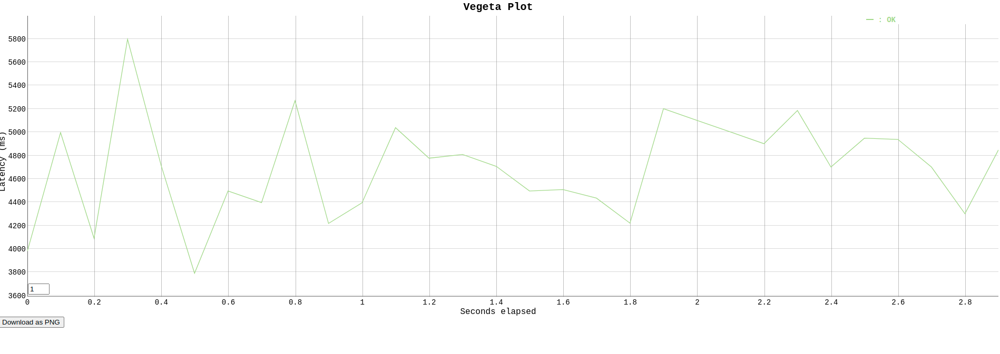
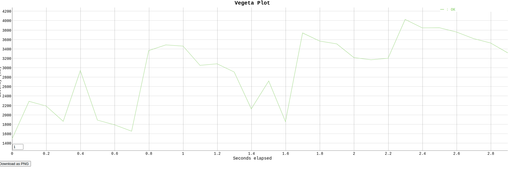
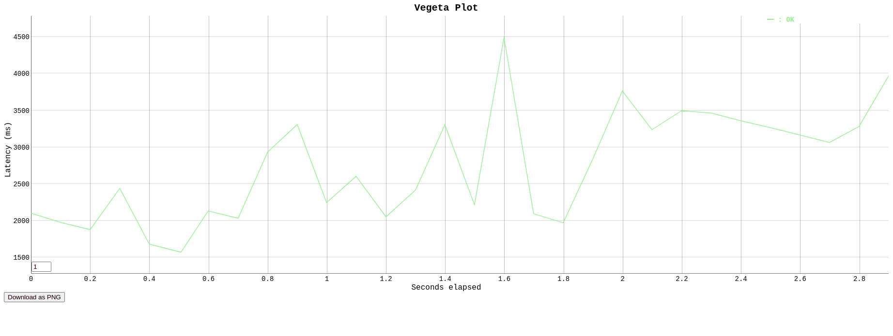

# Observability

This repository goal is to document the study of observability in microservices. This documentation is divided into three topics:
concepts, objectives and practical projects.

## Concepts

### What is Observability

´A simple way of describing observability is how well you can understand the system from the work it does. In control theory, observability is defined as <b>how engineers can infer the internal states of a system from knowledge of that system's external outputs</b>. Expanded to IT, software, and cloud computing, observability is how engineers can understand the current state of a system from the data it generates. To fully understand, you’ve got to proactively collect the right data, and then visualize it and apply intelligence.´ - https://newrelic.com/topics/what-is-observability

### Monitoring

Monitoring is part of a observability strategy

* Monitoring shows there is something wrong
* Monitoring is about knowing the key metrics of your business
* Monitoring allow us to understand why something is wrong

### Pilars

#### Metrics

Metric is a precise data that represents a info of your system.

##### Technical Metrics

Import data about your application health. Examples:

* Number of available pods
* Cpu usage
* Memory usage
* Error rate

##### Business Metrics

Import data for your business. Examples:

* Trials created
* Transactions performed
* Money amount transactioned
* Amount of active users

#### Logs

Log shows result of an event. You must have a good log solution, otherwise you will lost valuable data.

#### Tracing

Allows engineers to trace an event, and to see the all processes executed and the processes order, inputs and outputs 

## Objectives

### Avaiability

Today is common to have contracts or goals of avaiability. The percentage of avaiability can be different from software to software. But, in order to accomplish these avaiability goal, you must be able to evaluate your system avaiability through time, and also recover fast from problems. This is one objective of implementing observability. To increase the avaiability of your system.

### Compliance

Regulation about user data is increasing in the last few years. And every company has to attend to one or another regulation such as LGPD. A good log solution can help the company to provide proof of compliance. But always have in mind that the sensible data must be anonymized.

### Data Oriented Decision

Observability delivers information about the application. Business and technical information. It helps Product teams to make better decisions about product development.

## Pratical Projects

### Grafana

This project will monitor a stock portfolio ms with grafana. The ms is a Java/Springboot ms. The key objectives are to monitor if grafana integration will increse latency, and also to determine the valuable metrics that grafana provides. The project repo in github is this: https://github.com/adrianomr/stocks-portfolio

#### Latency

There were no latency changes after adding grafana and prometeus integration. This was measured with vegeta, a go library to performance tests. The results are below:

* Before grafana:

* After grafana:

#### Key Metrics

##### Micrometer JVM

Micrometer has a default dashboard that utilizes prometeus data to monitor requests rate, request errors, request duration, JVM Heap, JVM Non-Heap, JVM total memory, cpu usage, threads, log events and some other metrics.

### New Relic

This project will monitor a stock portfolio ms with New Relic. The ms is a Java/Springboot ms. The key objectives are to monitor if new relic integration will increse latency, and also to determine the valuable metrics that new relic provides. The project repo in github is this: https://github.com/adrianomr/stocks-portfolio

#### Micrometer Library

Micrometer is a library for collecting metrics from JVM-based applications and services and is included in Spring Boot 2 and backported to Spring Boot 1.3+. It is used by new relic to show application metrics

#### Key Metrics

New Relic has a dashboard with default metrics as memory use, request rate and etc. It also allows to analise database requests, web requests, JVM data, and other application metrics.

#### Latency

There were no latency changes after adding new relicintegration. This was measured with vegeta, a go library to performance tests. The results are below:

* Before new relic:

* After new relic:

https://newrelic.com/blog/how-to-relic/how-to-monitor-spring-boot-applications-using-micrometer-metrics

